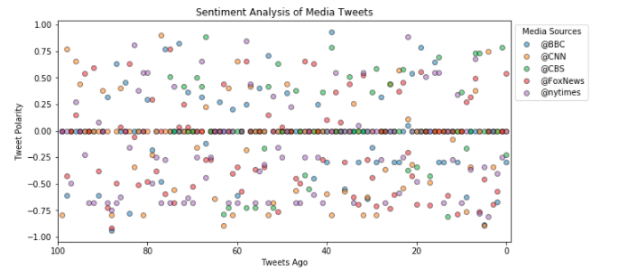
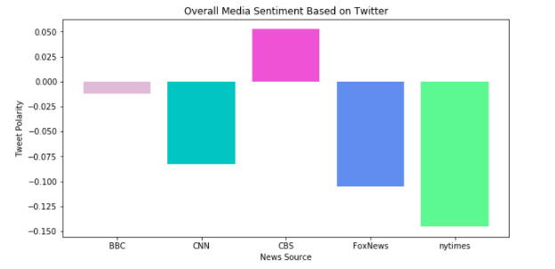

# Twitter_Sentiments
A Python script to perform a sentiment analysis of the Twitter activity of various news outlets, and presentation of findings.

Visualized summary of the sentiments expressed in Tweets sent out by the following news organizations: BBC, CBS, CNN, Fox, and New York times.

The first plot in the "Distinguishing News Sentiments" notebook features the following:

-Ascatter plot of sentiments of the last 100 tweets sent out by each news organization, ranging from -1.0 to 1.0, where a score of 0 expresses a neutral sentiment, -1 the most negative sentiment possible, and +1 the most positive sentiment possible.

-Each plot point reflects the compound sentiment of a tweet.

-Each plot point is sorted by its relative timestamp.

The second plot is a bar plot visualizing the overall sentiments of the last 100 tweets from each organization. 

